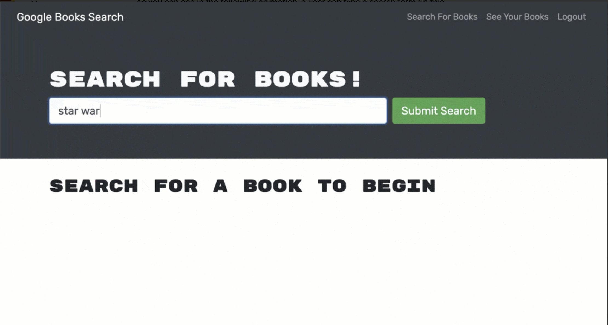

# Book Search Engine
A simple book search engine built with React app, Javascript and Mongodb. This application makes it simple to search for anybook you can imagine and find information about it. 

## Installation
Everything in this application is downloadeble in the terminal. To start clone the repository to your local machine and open it up. In the root directory open the terminal and run "npm i". This will install all the necessary dependacies. Then run "yarn start", the react app will start up. 

## Screen Shots

### built With
Javascript, MongoDB, React, Html, Sql and Node

### Contributers
William Hirsch

### License 
MIT License

